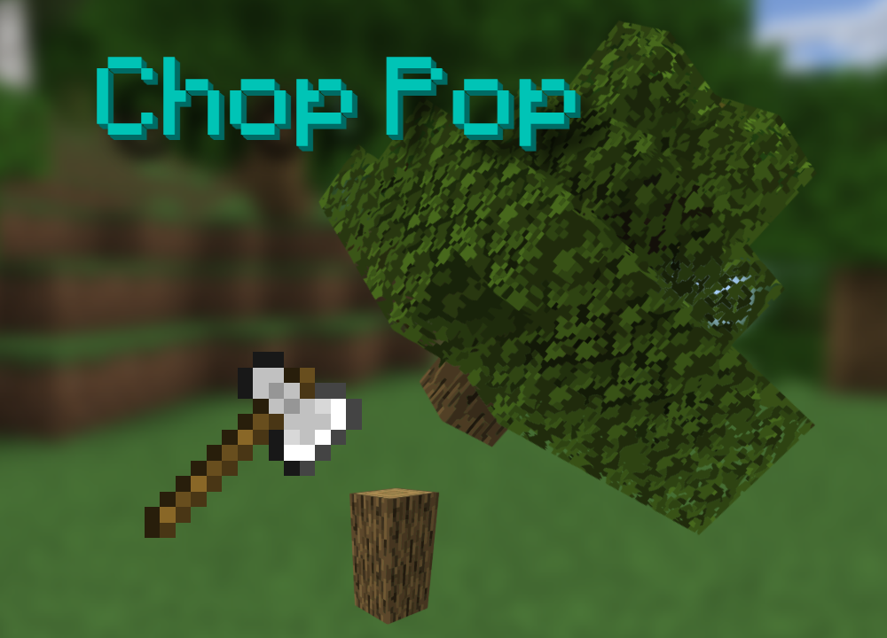
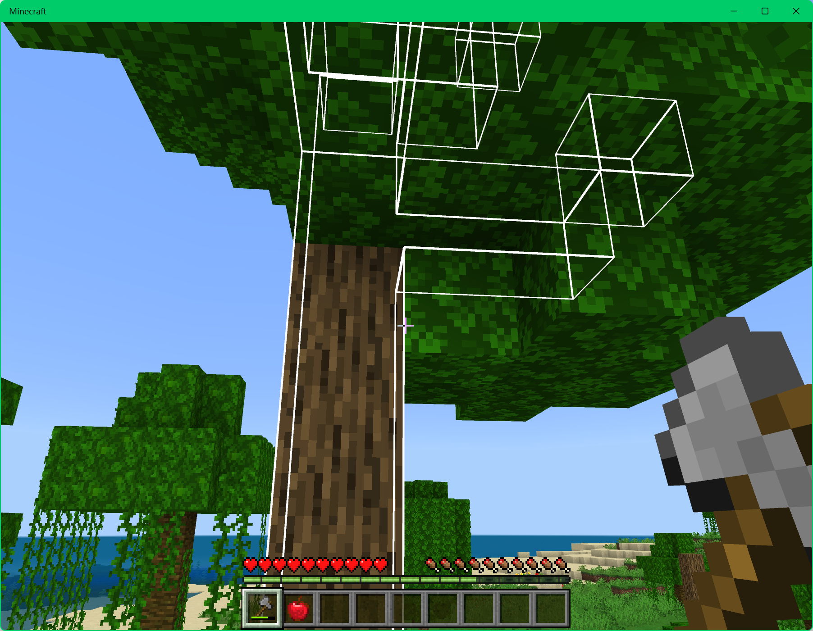

## 🪓 Chop Pop - Minecraft Bedrock Edition Add-on

> Cut down entire trees instantly – no more wasting time!

<p align="center">

</p>

## ✨ Features

- Automatically detects full tree structures
- Supports fast leaf decay (leaves begin to naturally decay immediately after chopping)
- Consumes axe durability and supports the "Unbreaking" enchantment; stops chopping when durability reaches 1
- Will not chop stripped logs
- Compatible with custom axes from other add-ons (must have `is_axe` tag)
- Supports custom trees from other add-ons (wood must have `wood` tag; leaves must include `leaves` in their name)
- Supports Nether “Crimson Stem” and “Warped Stem” blocks

## ✨ Visual Highlights (Optional)

Install [EdgeRender](https://github.com/mcbe-mods/EdgeRender) for outline highlights around detected tree blocks. Completely optional — the add-on works without it.



## ✅ Compatibility

> Uses the stable `Script API@1.18.0` and is compatible with all Minecraft versions starting from `1.21.80`.

## 📦 Download

Visit the GitHub Releases page to download:
👉 [ChopPop Releases](https://github.com/mcbe-mods/ChopPop/releases)

## 🎮 How to Use

1. Use any axe with the `is_axe` tag (including axes from other add-ons)
2. While sneaking, look at a full tree with the axe in hand. If the tree is detected, the blocks will be highlighted. (Requires optional [EdgeRender](https://github.com/mcbe-mods/EdgeRender) for visual highlights.)


## 🛠️ Debugging

Follow the official documentation for debugger setup:
🔗 [https://github.com/Mojang/minecraft-debugger](https://github.com/Mojang/minecraft-debugger)

After launching the game, run the following command to connect:

```
/script debugger connect localhost 19144
```

## License

[MIT](./LICENSE.md)
