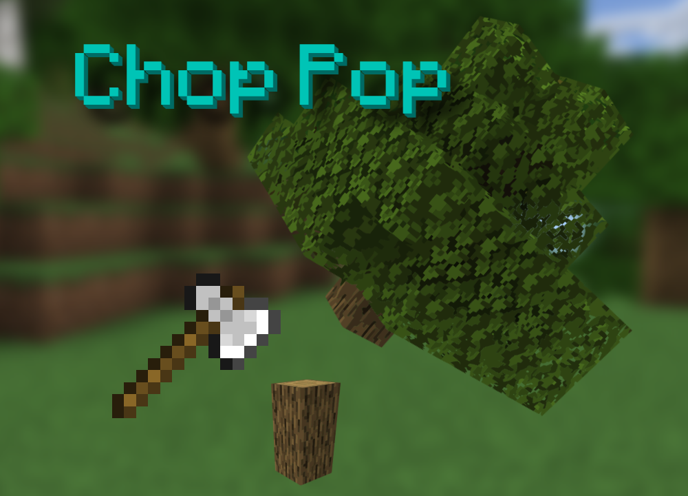

## 🪓 Chop Pop - Minecraft Bedrock Edition Add-on

<p align="right">
  <strong>English</strong> | <a href="README_CN.md">中文</a>
</p>

> Cut down entire trees instantly – no more wasting time!
> Inspired by [Cut-tree-one-click](https://github.com/mcbe-mods/Cut-tree-one-click)

<p align="center">

</p>

## ✨ Features

- Automatically detects full tree structures
- Supports fast leaf decay (leaves begin to naturally decay immediately after chopping)
- Visual indicator: an axe icon appears next to your crosshair when a tree is detected (prevents accidental house destruction)
- Consumes axe durability and supports the "Unbreaking" enchantment; stops chopping when durability reaches 1
- Will not chop stripped logs
- Compatible with custom axes from other add-ons (must have `is_axe` tag)
- Supports custom trees from other add-ons (wood must have `wood` tag; leaves must include `leaves` in their name)
- Supports Nether “Crimson Stem” and “Warped Stem” blocks

## ✅ Compatibility

> Uses the stable `Script API@1.11.x` and is compatible with all Minecraft versions starting from `1.21.0`.

## 📦 Download

Visit the GitHub Releases page to download:
👉 [ChopPop Releases](https://github.com/mcbe-mods/ChopPop/releases)

## 🎮 How to Use

1. Use any axe with the `is_axe` tag (including axes from other add-ons)
2. While sneaking, look at a full tree with the axe in hand. If the tree is detected, an axe icon will appear next to your crosshair – this means you’re ready to chop!


## 🛠️ Debugging

Follow the official documentation for debugger setup:
🔗 [https://github.com/Mojang/minecraft-debugger](https://github.com/Mojang/minecraft-debugger)

After launching the game, run the following command to connect:

```
/script debugger connect localhost 19144
```

## 📄 License

This project is licensed under **GPL-2.0**. You must comply with this license when using or modifying this project.

> Why GPL-2.0?
> During development, I struggled to find open and readable source code for similar mods. Many were obfuscated or poorly written. I hope this project encourages Minecraft players and modders to share their code openly so more people can learn and contribute. Let’s build a more active and creative Minecraft community together. And if you reuse someone else’s work, **always credit the original author. Respect open source!**
