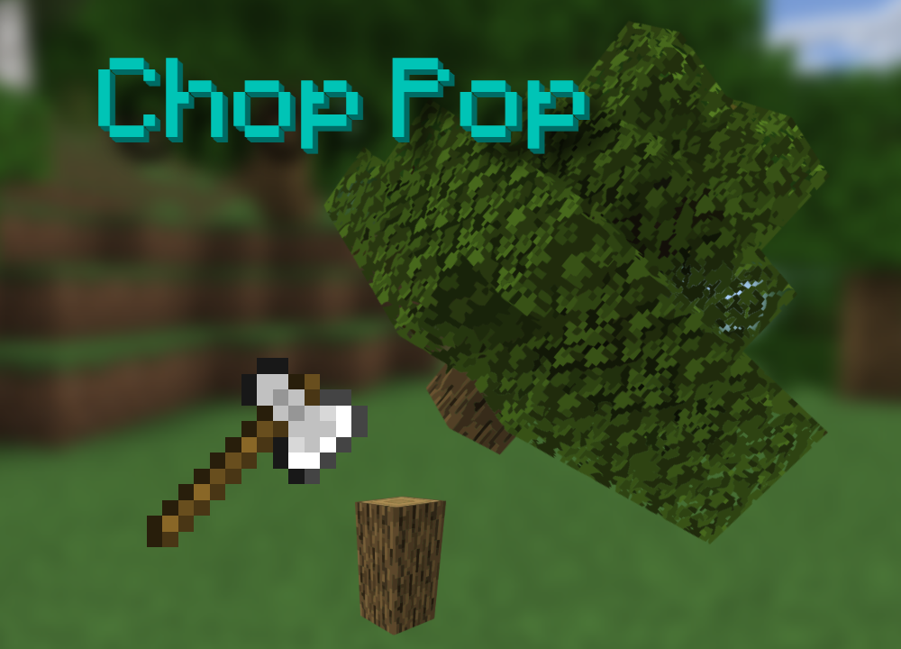

## 🪓 Chop Pop - Minecraft 基岩版模组

<p align="right">
  <a href="README.md">English</a> | <strong>中文</strong>
</p>

> 轻松砍树，不再浪费时间！
> 原版砍树太麻烦？试试这个模组吧！灵感来源：[旧版一键砍树插件](https://github.com/mcbe-mods/Cut-tree-one-click)

<p align="center">

</p>

## ✨ 功能特性

- 自动识别完整树木结构
- 支持树叶快速掉落（砍伐后立即开始自然凋落）
- 可视化提示：屏幕准星右侧显示斧头图标（防止误砍建筑）
- 消耗斧头耐久，支持“耐久”附魔，斧头剩余 1 点耐久时停止砍伐
- 不会砍去皮原木（stripped wood）
- 支持第三方模组的斧头（需有 `is_axe` 标签）
- 支持第三方模组的树木（木材需有 `wood` 标签，树叶名称包含 `leaves`）
- 支持地狱中的「绯红菌柄」与「诡异菌柄」

## ✅ 支持版本

> 使用稳定的 `Script API@1.11.x`，如无特殊标注它将兼容 `1.21.0` 及之后的所有版本。

## 📦 下载

前往 GitHub Releases 页面下载：
👉 [ChopPop Releases](https://github.com/mcbe-mods/ChopPop/releases)

## 🎮 使用方法

1. 使用任意拥有 `is_axe` 标签的斧头（支持第三方模组的斧头）
2. 潜行状态下手持斧头对准一棵完整的树，若检测成功，你会看到屏幕准星右侧出现一个斧头图标，表示可以砍伐整棵树


## 🛠️ 调试模式

查看官方调试说明文档：
🔗 [https://github.com/Mojang/minecraft-debugger](https://github.com/Mojang/minecraft-debugger)

进入游戏后执行命令以连接调试器：

```
/script debugger connect localhost 19144
```

## 📄 开源协议

本项目使用 GPL-2.0 开源协议，请务必遵守。

> 为什么使用 GPL-2.0？
> 在开发这个模组的过程中，我发现很多类似项目都不开源，或者代码被混淆，难以参考。我希望每位 Minecraft 玩家和模组开发者都能共享源代码，让更多人学习、参与开发，一起让社区更加活跃，游戏更加有趣。当然也请你在使用别人代码时注明作者，**请尊重每一位开源模组作者！**
